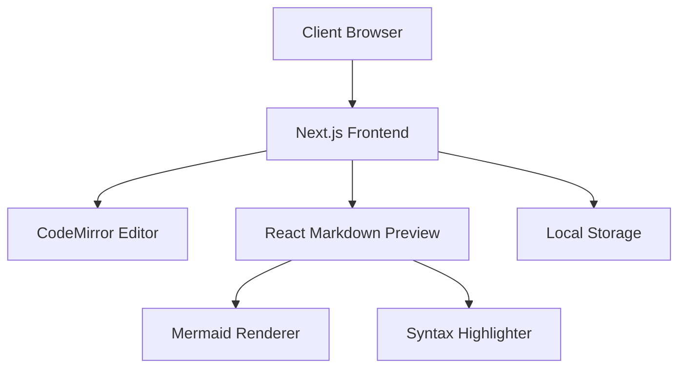
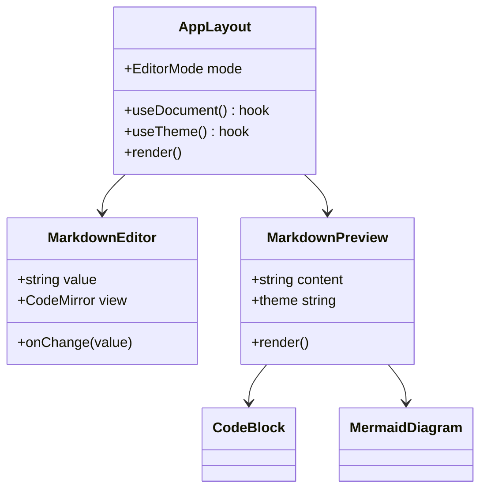
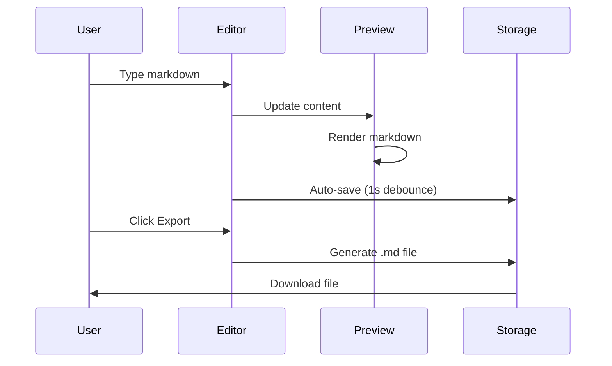
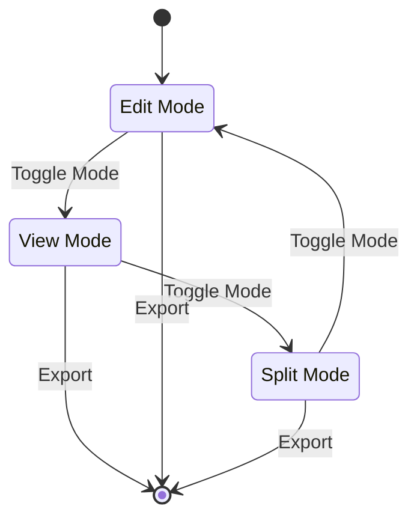
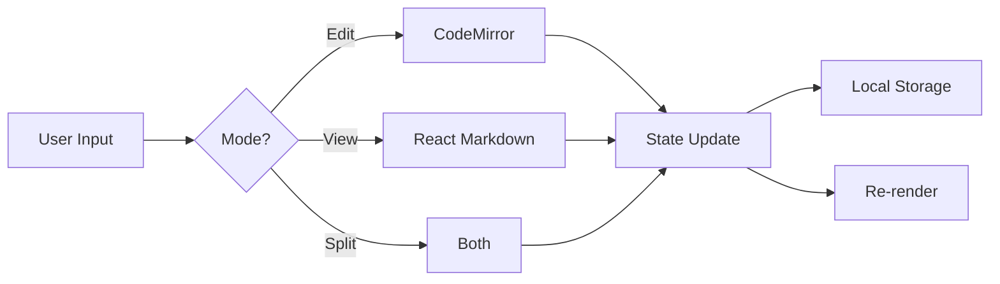
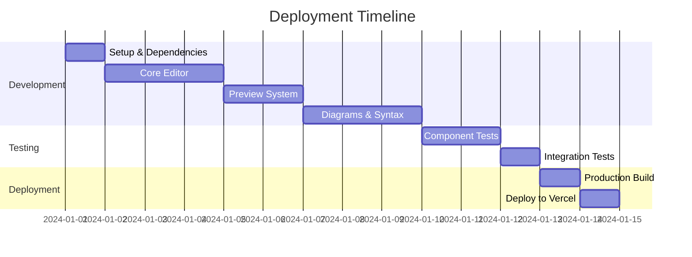

# Example Design Document

## Project Overview

This document demonstrates all the features available in the Design Document Editor. You can use this as a template for your own design documents.

## System Architecture

Here's a high-level architecture diagram using Mermaid:



## Component Structure



## Technical Stack

| Component | Technology | Version |
|-----------|------------|---------|
| Framework | Next.js | 16.1.0 |
| React | React | 19.2.3 |
| Editor | CodeMirror | 6.x |
| Styling | Tailwind CSS | 4.x |
| Diagrams | Mermaid.js | Latest |

## Code Examples

### TypeScript Example

Here's how we implement the document hook:

```typescript
export function useDocument() {
  const [content, setContent] = useLocalStorage<string>(
    "document-content",
    DEFAULT_CONTENT
  );
  
  const updateContent = useCallback(
    (newContent: string) => {
      setContent(newContent);
      setIsDirty(true);
    },
    [setContent]
  );

  return {
    content,
    updateContent,
    exportMarkdown,
    importMarkdown,
  };
}
```

### React Component Example

```jsx
export function CodeBlock({ language, value, theme }) {
  const [copied, setCopied] = useState(false);

  const handleCopy = async () => {
    await navigator.clipboard.writeText(value);
    setCopied(true);
    setTimeout(() => setCopied(false), 2000);
  };

  return (
    <div className="relative group">
      <button onClick={handleCopy}>
        {copied ? <Check /> : <Copy />}
      </button>
      <SyntaxHighlighter language={language} style={theme}>
        {value}
      </SyntaxHighlighter>
    </div>
  );
}
```

### Python Example

```python
def fibonacci(n):
    """Generate Fibonacci sequence up to n terms."""
    a, b = 0, 1
    result = []
    
    for _ in range(n):
        result.append(a)
        a, b = b, a + b
    
    return result

# Example usage
print(fibonacci(10))
```

## User Flow



## State Management



## Feature Callouts

:::info
**Auto-save Feature**: The editor automatically saves your work to localStorage every second after you stop typing. This ensures you never lose your work!
:::

:::tip
**Keyboard Shortcuts**: Use the toolbar buttons for quick access to common markdown formatting. More keyboard shortcuts coming soon!
:::

:::warning
**Large Documents**: For documents over 10,000 words, performance may be impacted. Consider breaking them into smaller files.
:::

:::error
**Browser Compatibility**: This editor requires a modern browser with ES6+ support. Internet Explorer is not supported.
:::

## Data Flow



## Deployment Process



## API Documentation

### Document Hook API

```typescript
interface UseDocumentReturn {
  content: string;
  title: string;
  lastSaved?: Date;
  isDirty: boolean;
  updateContent: (content: string) => void;
  updateTitle: (title: string) => void;
  exportMarkdown: () => void;
  importMarkdown: (file: File) => void;
}
```

### Theme Hook API

```typescript
interface UseThemeReturn {
  theme: "light" | "dark";
  setTheme: (theme: "light" | "dark") => void;
  toggleTheme: () => void;
}
```

## Performance Considerations

1. **Code Splitting**: Next.js automatically splits code at the page level
2. **Lazy Loading**: Mermaid is dynamically imported to reduce initial bundle size
3. **Memoization**: Preview components use React.memo to prevent unnecessary re-renders
4. **Debouncing**: Auto-save is debounced to reduce localStorage writes

## Security

- All user input is sanitized through `rehype-sanitize`
- Mermaid's `securityLevel` is set to "loose" (consider "strict" for production)
- No external API calls except for optional PlantUML (removed in current version)
- All data stored locally in browser

## Accessibility

- Semantic HTML structure
- ARIA labels on interactive elements
- Keyboard navigation support
- High contrast mode compatible
- Screen reader friendly

## Browser Support

| Browser | Minimum Version | Status |
|---------|----------------|--------|
| Chrome | 90+ | ✅ Fully Supported |
| Firefox | 88+ | ✅ Fully Supported |
| Safari | 14+ | ✅ Fully Supported |
| Edge | 90+ | ✅ Fully Supported |
| IE 11 | - | ❌ Not Supported |

## Conclusion

This design document editor provides a powerful, modern interface for creating technical documentation with rich formatting, code examples, and diagrams. It's built with performance, usability, and extensibility in mind.

---

**Last Updated**: December 19, 2025  
**Version**: 1.0.0  
**Author**: Design Doc Team


