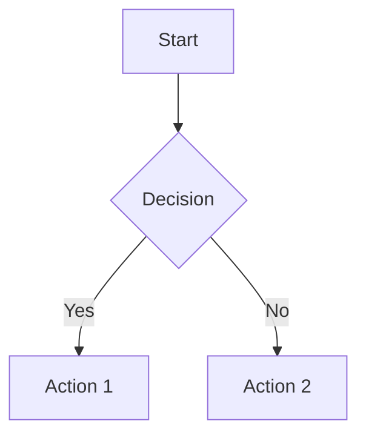

# Design Document Editor

A modern, feature-rich WYSIWYG markdown editor built with Next.js for creating high-level design documents. Supports real-time preview, syntax-highlighted code blocks, Mermaid diagrams, and more.


## ✨ Features

### 📝 Markdown Editing
- **Three View Modes**: Edit, View, and Split (side-by-side)
- **CodeMirror 6** integration with markdown syntax highlighting
- **Real-time Preview** with GitHub Flavored Markdown (GFM)
- **Formatting Toolbar** with quick access to common markdown syntax

### 💻 Code Blocks
- **Syntax Highlighting** via Prism.js for 10+ languages
- **Copy to Clipboard** functionality
- **Line Numbers** display
- Support for TypeScript, JavaScript, Python, Java, Go, SQL, YAML, JSON, Shell, and more

### 📊 Diagrams
- **Mermaid.js Integration** for various diagram types:
  - Flowcharts
  - Sequence diagrams
  - Class diagrams
  - State diagrams
  - Entity Relationship diagrams
  - Gantt charts
  - User Journey diagrams

### 🎨 Customization
- **Dark/Light Theme** toggle
- **Responsive Design** for mobile and desktop
- **Custom Callouts** (info, warning, error, tip)
- **Resizable Split View** with drag handle

### 💾 Document Management
- **Auto-save** to localStorage (1 second debounce)
- **Export** to `.md` file
- **Import** existing markdown files
- **Document Statistics** (word count, character count, line count)

## 🚀 Getting Started

### Prerequisites
- Node.js 18+ and npm

### Installation

```bash
# Navigate to the project directory
cd design-doc

# Install dependencies
npm install

# Start development server
npm run dev
```

Open [http://localhost:3000](http://localhost:3000) in your browser.

### Production Build

```bash
# Build for production
npm run build

# Start production server
npm start
```

## 📖 Usage

### Basic Editing

1. **Edit Mode**: Write markdown with syntax highlighting
2. **View Mode**: See the rendered output
3. **Split Mode**: Edit and preview side-by-side

### Inserting Code Blocks

Use the code block button in the toolbar or type:

````markdown
```typescript
function greet(name: string): string {
  return `Hello, ${name}!`;
}
```
````

### Creating Diagrams

Use Mermaid syntax:

````markdown

````

### Adding Callouts

Use the triple-colon syntax:

```markdown
:::info
This is an informational callout
:::

:::warning
This is a warning message
:::

:::error
This is an error message
:::

:::tip
This is a helpful tip
:::
```

### Keyboard Shortcuts

| Action | Shortcut |
|--------|----------|
| Bold | `Ctrl/Cmd + B` (planned) |
| Italic | `Ctrl/Cmd + I` (planned) |
| Toggle Mode | `Ctrl/Cmd + E` (planned) |
| Save | `Ctrl/Cmd + S` (auto-save enabled) |

## 🏗️ Architecture

```
design-doc/
├── app/                      # Next.js app directory
│   ├── globals.css          # Global styles
│   ├── layout.tsx           # Root layout
│   └── page.tsx             # Main page (AppLayout)
├── components/
│   ├── Editor/              # Editor components
│   │   ├── MarkdownEditor.tsx
│   │   └── EditorToolbar.tsx
│   ├── Preview/             # Preview components
│   │   ├── MarkdownPreview.tsx
│   │   ├── CodeBlock.tsx
│   │   ├── MermaidDiagram.tsx
│   │   └── Callout.tsx
│   └── Layout/              # Layout components
│       ├── AppLayout.tsx
│       ├── Header.tsx
│       ├── Footer.tsx
│       ├── ModeToggle.tsx
│       └── SplitPane.tsx
├── hooks/                   # Custom React hooks
│   ├── useDocument.ts       # Document state management
│   ├── useLocalStorage.ts   # localStorage persistence
│   └── useTheme.ts          # Theme management
├── utils/                   # Utility functions
│   ├── markdown.ts          # Markdown helpers
│   └── export.ts            # Export utilities
├── types/                   # TypeScript type definitions
│   └── index.ts
└── styles/                  # Additional CSS
    ├── editor.css
    └── preview.css
```

## 🛠️ Tech Stack

| Component | Technology | Purpose |
|-----------|------------|---------|
| Framework | Next.js 16 + React 19 | SSR and routing |
| Styling | Tailwind CSS 4 | Utility-first styling |
| Editor | CodeMirror 6 | Markdown editing |
| Rendering | react-markdown + remark-gfm | Markdown preview |
| Syntax Highlighting | react-syntax-highlighter (Prism) | Code blocks |
| Diagrams | Mermaid.js | Diagram rendering |
| Icons | Lucide React | UI icons |
| Language | TypeScript 5 | Type safety |

## 📦 Dependencies

```json
{
  "dependencies": {
    "@codemirror/commands": "^6.x",
    "@codemirror/lang-markdown": "^6.x",
    "@codemirror/language-data": "^6.x",
    "@codemirror/state": "^6.x",
    "@codemirror/view": "^6.x",
    "codemirror": "^6.x",
    "lucide-react": "latest",
    "mermaid": "latest",
    "next": "16.1.0",
    "react": "19.2.3",
    "react-dom": "19.2.3",
    "react-markdown": "latest",
    "react-syntax-highlighter": "latest",
    "rehype-raw": "latest",
    "rehype-sanitize": "latest",
    "remark-gfm": "latest"
  }
}
```

## 🎯 Future Enhancements

- [ ] Collaborative editing with WebRTC
- [ ] Cloud storage integration (Google Drive, Dropbox)
- [ ] Version history with git-like commits
- [ ] Template library for common document types
- [ ] AI-powered writing assistance
- [ ] Image upload via drag-and-drop
- [ ] Auto-generated table of contents
- [ ] Search and replace functionality
- [ ] Custom keyboard shortcuts configuration
- [ ] Export to PDF with custom styling
- [ ] Presentation mode (slide view)

## 🐛 Known Issues

- Keyboard shortcuts for formatting not yet implemented
- CodeMirror cursor position for toolbar insertions needs improvement
- Mobile toolbar may need better touch targets

## 🤝 Contributing

Contributions are welcome! Please feel free to submit a Pull Request.

## 📄 License

This project is open source and available under the MIT License.

## 👏 Acknowledgments

- [CodeMirror](https://codemirror.net/) - Excellent code editor
- [Mermaid.js](https://mermaid.js.org/) - Beautiful diagram generation
- [react-markdown](https://github.com/remarkjs/react-markdown) - Markdown rendering
- [Tailwind CSS](https://tailwindcss.com/) - Utility-first CSS framework
- [Lucide](https://lucide.dev/) - Beautiful icon set

---

Built with ❤️ using Next.js and React
