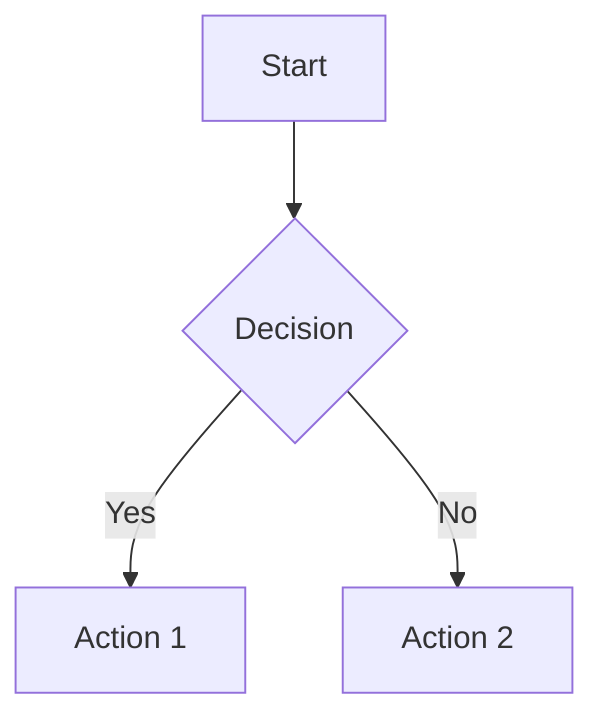

# Design Document Editor - Development Plan

## Project Overview

Build a Single Page Application (SPA) using Next.js that allows users to create high-level design documents in markdown format with WYSIWYG-style editing capabilities. The application supports:

- **View Mode**: Renders markdown beautifully with syntax-highlighted code and diagrams
- **Edit Mode**: Shows raw markdown with syntax highlighting for editing
- **Embedded Widgets**: Code snippets with syntax highlighting and Mermaid diagrams

---

## Technology Stack

| Component           | Technology                            | Rationale                                       |
| ------------------- | ------------------------------------- | ----------------------------------------------- |
| Framework           | Next.js 16 + React 19                 | Already initialized, excellent SPA support      |
| Styling             | Tailwind CSS 4                        | Already configured, rapid UI development        |
| Editor              | CodeMirror 6                          | Modern, extensible, excellent markdown support  |
| Markdown Rendering  | react-markdown + remark/rehype        | Industry standard, highly customizable          |
| Syntax Highlighting | Prism.js via react-syntax-highlighter | Wide language support, beautiful themes         |
| Diagrams            | Mermaid.js                            | Client-side rendering, no external dependencies |
| State Management    | React useState/useReducer             | Sufficient for SPA, no external lib needed      |

---

## Dependencies to Install

```bash
# Core Editor
npm install codemirror @codemirror/view @codemirror/state @codemirror/commands
npm install @codemirror/lang-markdown @codemirror/language-data

# Markdown Rendering
npm install react-markdown remark-gfm rehype-raw rehype-sanitize

# Syntax Highlighting
npm install react-syntax-highlighter
npm install --save-dev @types/react-syntax-highlighter

# Diagram Support
npm install mermaid
```

---

## Phase 1: Core Editor Setup

### 1.1 CodeMirror 6 Integration (Days 1-2)

**Tasks:**

- [ ] Create `components/Editor/MarkdownEditor.tsx` - CodeMirror wrapper component
- [ ] Configure CodeMirror with markdown language support
- [ ] Add syntax highlighting for markdown in edit mode
- [ ] Implement controlled component pattern with value/onChange props
- [ ] Add line numbers, code folding, and bracket matching
- [ ] Style editor to match application theme

**Key Implementation Details:**

```typescript
// Core CodeMirror extensions needed:
import { markdown, markdownLanguage } from "@codemirror/lang-markdown";
import { languages } from "@codemirror/language-data";
import { EditorState } from "@codemirror/state";
import {
  EditorView,
  keymap,
  lineNumbers,
  highlightActiveLineGutter,
} from "@codemirror/view";
import { defaultKeymap, history, historyKeymap } from "@codemirror/commands";
import {
  syntaxHighlighting,
  defaultHighlightStyle,
} from "@codemirror/language";
```

**File Structure:**

```
components/
  Editor/
    MarkdownEditor.tsx      # Main CodeMirror wrapper
    EditorToolbar.tsx       # Formatting buttons (bold, italic, etc.)
    useCodeMirror.ts        # Custom hook for CodeMirror setup
```

### 1.2 Markdown Preview Component (Days 2-3)

**Tasks:**

- [ ] Create `components/Preview/MarkdownPreview.tsx`
- [ ] Configure react-markdown with GFM (GitHub Flavored Markdown)
- [ ] Set up custom renderers for headings, lists, tables, blockquotes
- [ ] Implement proper styling for all markdown elements
- [ ] Add scroll synchronization with editor (stretch goal)

**Key Implementation:**

```typescript
import ReactMarkdown from "react-markdown";
import remarkGfm from "remark-gfm";
import rehypeRaw from "rehype-raw";

// Custom components for rendering
const components = {
  h1: ({ children }) => <h1 className="text-3xl font-bold mb-4">{children}</h1>,
  h2: ({ children }) => (
    <h2 className="text-2xl font-semibold mb-3">{children}</h2>
  ),
  // ... etc
};
```

---

## Phase 2: Code Block Support

### 2.1 Syntax Highlighting in Preview (Day 3)

**Tasks:**

- [ ] Create `components/Preview/CodeBlock.tsx`
- [ ] Integrate react-syntax-highlighter with Prism
- [ ] Support language detection from markdown fence (```language)
- [ ] Add copy-to-clipboard functionality
- [ ] Implement line numbers toggle
- [ ] Create beautiful code block styling with theme support

**Supported Languages (Priority):**

- TypeScript/JavaScript
- Python
- Java
- Go
- SQL
- YAML/JSON
- Shell/Bash
- Markdown

**Code Block Features:**

```typescript
interface CodeBlockProps {
  language: string;
  value: string;
  showLineNumbers?: boolean;
  highlightLines?: number[];
  filename?: string; // Optional filename display
}
```

### 2.2 Code Block Insertion Widget (Day 4)

**Tasks:**

- [ ] Create toolbar button for inserting code blocks
- [ ] Implement language selector dropdown
- [ ] Auto-insert code fence with selected language
- [ ] Handle cursor positioning after insertion

---

## Phase 3: Diagram Support

### 3.1 Mermaid.js Integration (Days 4-5)

**Tasks:**

- [ ] Create `components/Preview/MermaidDiagram.tsx`
- [ ] Initialize Mermaid with custom theme
- [ ] Implement client-side rendering (Mermaid requires DOM)
- [ ] Handle SSR issues with dynamic import
- [ ] Add error handling for invalid syntax

**Mermaid Configuration:**

```typescript
import mermaid from "mermaid";

mermaid.initialize({
  startOnLoad: false,
  theme: "neutral",
  securityLevel: "loose",
  flowchart: { useMaxWidth: true },
});
```

**Supported Diagram Types:**

- Flowcharts
- Sequence diagrams
- Gantt charts
- Class diagrams
- State diagrams
- Entity Relationship diagrams
- User Journey diagrams

**Markdown Syntax for Mermaid:**

````markdown

````

### 3.2 Diagram Insertion Widget (Day 5)

**Tasks:**

- [ ] Create diagram type selector for Mermaid diagram types
- [ ] Provide templates for common diagram types (flowchart, sequence, class, etc.)
- [ ] Implement diagram preview while editing

---

## Phase 4: View/Edit Mode System

### 4.1 Mode Toggle Implementation (Day 7)

**Tasks:**

- [ ] Create `components/Layout/ModeToggle.tsx`
- [ ] Implement smooth transition between modes
- [ ] Add keyboard shortcut (Ctrl/Cmd + E) to toggle
- [ ] Persist mode preference in localStorage
- [ ] Create split-view option (side-by-side edit + preview)

**Mode Types:**

```typescript
type EditorMode = "edit" | "view" | "split";
```

### 4.2 Application Layout (Days 7-8)

**Tasks:**

- [ ] Create `components/Layout/AppLayout.tsx`
- [ ] Design responsive header with mode toggle
- [ ] Implement resizable split pane for split mode
- [ ] Add sidebar for document outline (TOC)
- [ ] Create footer with word count, save status

**Layout Structure:**

```
┌─────────────────────────────────────────────────┐
│  Header: Title | Mode Toggle | Actions          │
├─────────────────────────────────────────────────┤
│ Sidebar │  Main Content Area                    │
│ (TOC)   │  ┌─────────────────────────────────┐  │
│         │  │  Edit Mode: CodeMirror          │  │
│         │  │  View Mode: Rendered Preview    │  │
│         │  │  Split: Both side by side       │  │
│         │  └─────────────────────────────────┘  │
├─────────────────────────────────────────────────┤
│  Footer: Word Count | Last Saved | etc          │
└─────────────────────────────────────────────────┘
```

---

## Phase 5: Widget System

### 5.1 Custom Block Architecture (Days 8-9)

**Tasks:**

- [ ] Design widget/block plugin system
- [ ] Create `components/Widgets/Widget.tsx` base component
- [ ] Implement widget type detection from markdown
- [ ] Create widget registry for extensibility

**Widget Types:**

```typescript
type WidgetType = "code" | "mermaid" | "callout" | "table";

interface Widget {
  type: WidgetType;
  content: string;
  props?: Record<string, unknown>;
}
```

### 5.2 Callout/Admonition Blocks (Day 9)

**Tasks:**

- [ ] Create callout component (info, warning, error, tip)
- [ ] Support custom callout syntax in markdown
- [ ] Design beautiful callout styles

**Callout Syntax:**

```markdown
:::info
This is an informational callout
:::

:::warning
This is a warning callout
:::
```

---

## Phase 6: Document Management

### 6.1 Local Storage Persistence (Day 10)

**Tasks:**

- [ ] Implement auto-save to localStorage
- [ ] Add manual save trigger
- [ ] Create save indicator (saved/unsaved state)
- [ ] Implement document history/versioning (optional)

### 6.2 File Export/Import (Days 10-11)

**Tasks:**

- [ ] Export to `.md` file download
- [ ] Import existing `.md` files
- [ ] Export to PDF (using browser print)
- [ ] Export to HTML (rendered version)

---

## Phase 7: Polish & UX

### 7.1 Editor Toolbar (Day 11)

**Tasks:**

- [ ] Create formatting toolbar (Bold, Italic, Heading, List, etc.)
- [ ] Add insert menu (Code, Diagram, Image, Link, Table)
- [ ] Implement keyboard shortcuts
- [ ] Add undo/redo buttons

**Keyboard Shortcuts:**
| Action | Shortcut |
|--------|----------|
| Bold | Ctrl/Cmd + B |
| Italic | Ctrl/Cmd + I |
| Toggle Mode | Ctrl/Cmd + E |
| Save | Ctrl/Cmd + S |
| Insert Code | Ctrl/Cmd + Shift + C |

### 7.2 Theming & Styling (Day 12)

**Tasks:**

- [ ] Create dark/light theme toggle
- [ ] Design custom CodeMirror theme
- [ ] Style markdown preview to match theme
- [ ] Ensure consistent design language

### 7.3 Responsive Design (Day 12)

**Tasks:**

- [ ] Mobile-friendly layout
- [ ] Touch-friendly toolbar
- [ ] Responsive split view (stack on mobile)

---

## Phase 8: Testing & Documentation

### 8.1 Testing (Day 13)

**Tasks:**

- [ ] Unit tests for utility functions
- [ ] Component tests for key components
- [ ] Integration tests for editor/preview sync
- [ ] Manual testing of all diagram types

### 8.2 Documentation (Day 13)

**Tasks:**

- [ ] Update README with setup instructions
- [ ] Document supported markdown syntax
- [ ] Create example design document
- [ ] Document keyboard shortcuts

---

## File Structure (Final)

```
design-doc/
├── app/
│   ├── globals.css
│   ├── layout.tsx
│   └── page.tsx                    # Main SPA entry point
├── components/
│   ├── Editor/
│   │   ├── MarkdownEditor.tsx      # CodeMirror wrapper
│   │   ├── EditorToolbar.tsx       # Formatting toolbar
│   │   └── useCodeMirror.ts        # CodeMirror hook
│   ├── Preview/
│   │   ├── MarkdownPreview.tsx     # Main preview component
│   │   ├── CodeBlock.tsx           # Syntax highlighted code
│   │   ├── MermaidDiagram.tsx      # Mermaid diagram renderer
│   │   └── Callout.tsx             # Callout/admonition blocks
│   ├── Layout/
│   │   ├── AppLayout.tsx           # Main layout wrapper
│   │   ├── Header.tsx              # App header
│   │   ├── Sidebar.tsx             # Document outline/TOC
│   │   ├── ModeToggle.tsx          # Edit/View/Split toggle
│   │   └── SplitPane.tsx           # Resizable split view
│   └── Widgets/
│       ├── Widget.tsx              # Base widget component
│       ├── WidgetRegistry.ts       # Widget type registry
│       └── InsertMenu.tsx          # Widget insertion menu
├── hooks/
│   ├── useDocument.ts              # Document state management
│   ├── useLocalStorage.ts          # Persistence hook
│   └── useTheme.ts                 # Theme management
├── utils/
│   ├── markdown.ts                 # Markdown parsing helpers
│   └── export.ts                   # Export functionality
├── styles/
│   ├── editor.css                  # CodeMirror custom styles
│   └── preview.css                 # Preview component styles
└── types/
    └── index.ts                    # TypeScript type definitions
```

---

## Estimated Timeline

| Phase | Description         | Duration | Status         |
| ----- | ------------------- | -------- | -------------- |
| 1     | Core Editor Setup   | 3 days   | ⬜ Not Started |
| 2     | Code Block Support  | 2 days   | ⬜ Not Started |
| 3     | Diagram Support     | 2 days   | ⬜ Not Started |
| 4     | View/Edit Modes     | 2 days   | ⬜ Not Started |
| 5     | Widget System       | 2 days   | ⬜ Not Started |
| 6     | Document Management | 2 days   | ⬜ Not Started |
| 7     | Polish & UX         | 2 days   | ⬜ Not Started |
| 8     | Testing & Docs      | 1 day    | ⬜ Not Started |

**Total Estimated Time: ~16 days**

---

## Risk Mitigation

| Risk                       | Impact | Mitigation                                    |
| -------------------------- | ------ | --------------------------------------------- |
| Mermaid SSR issues         | Medium | Use dynamic imports with `ssr: false`         |
| Large document performance | Medium | Implement virtualization for large docs       |
| Browser compatibility      | Low    | Test on major browsers, use polyfills         |
| Complex diagram rendering  | Low    | Debounce re-renders, cache diagram SVG output |

---

## Future Enhancements (Post-MVP)

1. **Collaboration** - Real-time multi-user editing with CRDT
2. **Cloud Storage** - Save/load from cloud providers
3. **Version Control** - Git-like versioning for documents
4. **Custom Themes** - User-defined color schemes
5. **Template Library** - Pre-built design doc templates
6. **AI Assistance** - AI-powered writing suggestions
7. **Image Upload** - Drag-and-drop image embedding
8. **Table of Contents** - Auto-generated from headings
9. **Search & Replace** - Advanced find/replace in editor
10. **Presentation Mode** - Slide-style view of sections

---

## Getting Started (Quick Start for Phase 1)

```bash
# Navigate to project
cd design-doc

# Install dependencies
npm install codemirror @codemirror/view @codemirror/state @codemirror/commands \
  @codemirror/lang-markdown @codemirror/language-data \
  react-markdown remark-gfm rehype-raw \
  react-syntax-highlighter mermaid

# Install types
npm install --save-dev @types/react-syntax-highlighter

# Start development server
npm run dev
```

---

## References

- [CodeMirror 6 Documentation](https://codemirror.net/docs/)
- [react-markdown GitHub](https://github.com/remarkjs/react-markdown)
- [Mermaid.js Documentation](https://mermaid.js.org/)
- [react-syntax-highlighter](https://github.com/react-syntax-highlighter/react-syntax-highlighter)
- [Tailwind CSS](https://tailwindcss.com/docs)
